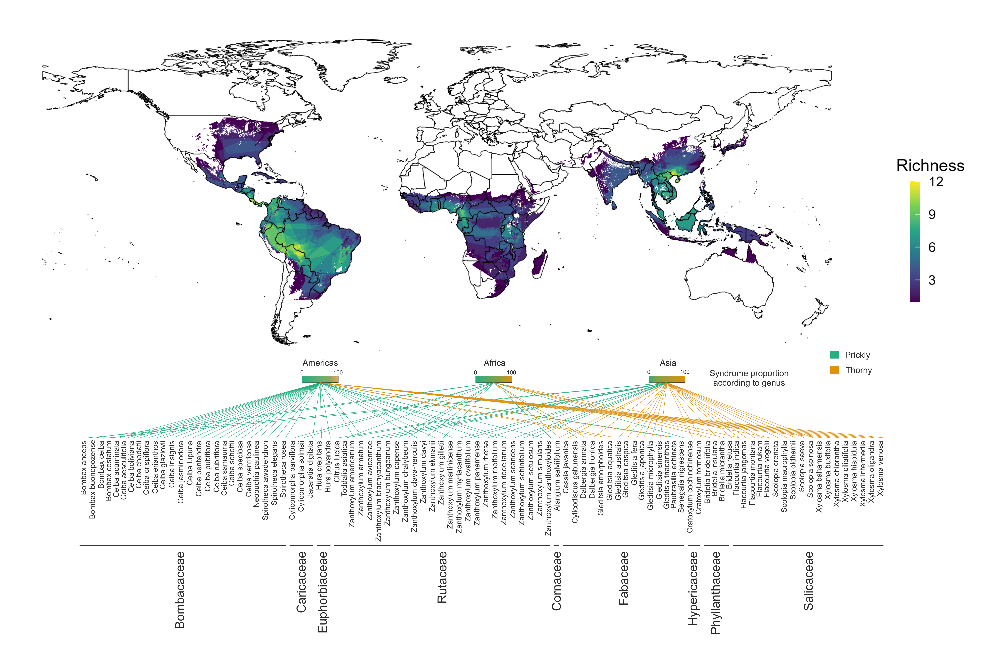
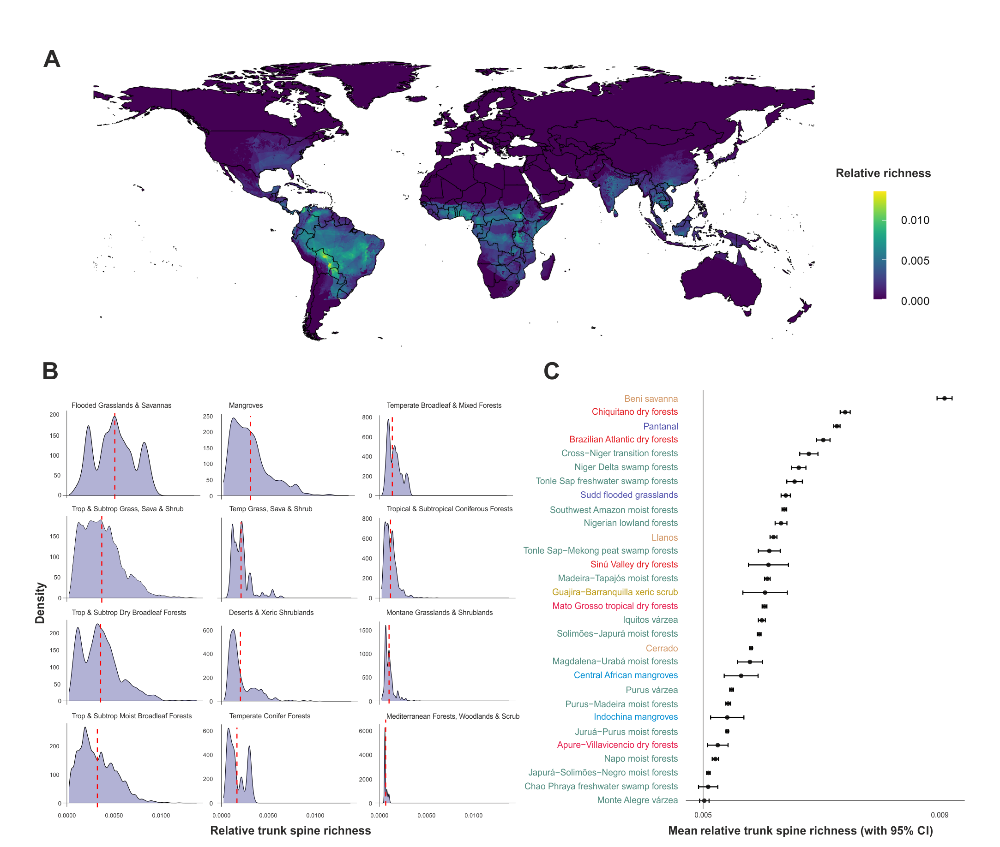
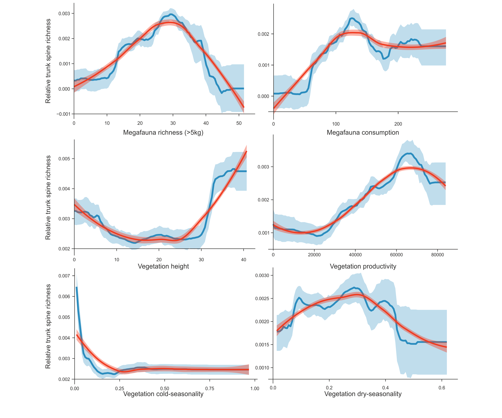
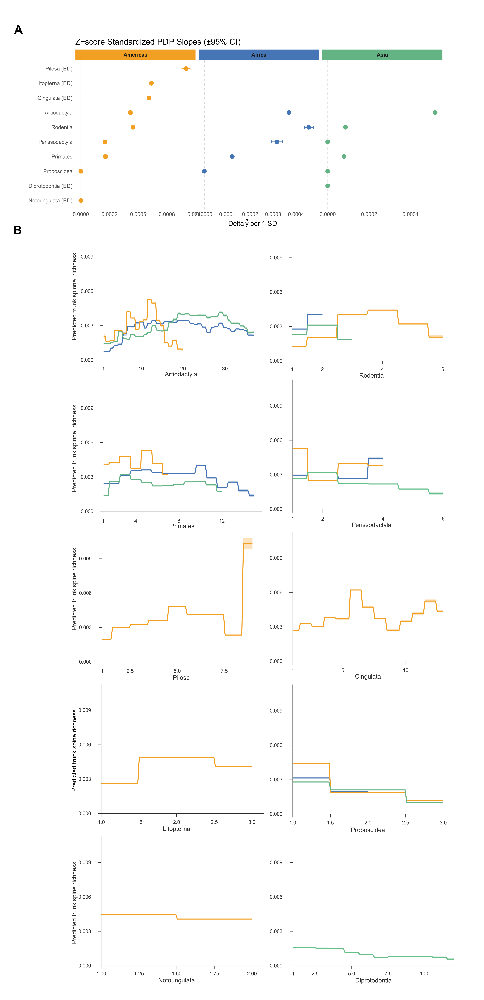

# Geospatial Machine Learning Pipeline in R

> Reproducible geospatial machine-learning workflow for modelling the global distribution, ecological associations, and evolutionary drivers of spiny-trunk woody plants.

This repository demonstrates an end-to-end geospatial data science pipeline in R. It integrates biodiversity data, global raster layers, mammal distribution data, environmental predictors, spatial feature engineering, gradient-boosted machine learning, spatial cross-validation, bootstrap uncertainty estimation, and interpretable model outputs.

The project is designed as a technical portfolio piece showing applied expertise in:

- geospatial data engineering,
- raster and vector spatial processing,
- biodiversity informatics,
- statistical modelling,
- machine learning,
- spatial cross-validation,
- uncertainty quantification,
- interpretable machine learning,
- reproducible scientific computing.

---

## Project Objective

The goal of the project is to model the global distribution and ecological drivers of woody plant species bearing trunk spines.

The analysis focuses on relative spiny-trunk richness, environmental gradients, vegetation structure, climate seasonality, and herbivore-related predictors. The workflow evaluates whether spiny-trunk richness is associated with environmental conditions and mammal herbivory pressure, including associations with specific mammal clades.

The project combines ecological theory with computational modelling to test whether present and historical mammal communities help explain the contemporary geography of trunk-spine defences.

---

## Technical Overview

The pipeline implements:

- multi-source data integration,
- species-name standardization,
- global raster processing,
- vector/raster spatial overlay,
- spatial harmonization to a common grid,
- construction of relative richness metrics,
- extraction of environmental and biotic predictors,
- model-ready tabular data generation,
- CatBoost gradient-boosted regression,
- monotonic and unconstrained model comparison,
- spatial cross-validation using `blockCV`,
- bootstrap-based uncertainty estimation,
- partial dependence analysis,
- curated GitHub-ready figures and methodological documentation.

The workflow is implemented in R and uses memory-efficient spatial operations with `terra`.

---

## Data and Feature Engineering

The workflow integrates multiple data sources:

- woody plant species with confirmed trunk spines,
- plant distribution/range data,
- global woody plant richness estimates,
- mammal distribution and richness data,
- herbivory-pressure and consumption estimates,
- climate and vegetation predictors,
- biome and ecoregion boundaries,
- remote-sensing-derived vegetation structure.

Feature construction includes:

- spatial harmonization to a common global grid,
- raster stacking and alignment,
- extraction of predictors by grid cell,
- construction of absolute and relative richness layers,
- biome and ecoregion summarization,
- integration of environmental, vegetation, and herbivore-related predictors,
- conversion of geospatial layers into model-ready tabular data.

---

## Machine Learning Task

The main supervised-learning task is to predict relative spiny-trunk richness from environmental and biotic predictors.

**Response variable**

\[
y_i = \text{relative spiny-trunk richness in grid cell } i
\]

**Predictors include**

- vegetation productivity,
- dry-season deciduousness,
- cold-season deciduousness,
- vegetation height,
- mammal richness,
- modelled plant consumption,
- mammal clade richness,
- continental or regional structure.

The modelling objective is:

\[
y_i = f(\mathbf{x}_i) + \varepsilon_i,
\]

where \(\mathbf{x}_i\) is a vector of environmental and herbivore-related predictors, \(f\) is a nonlinear function estimated using gradient-boosted decision trees, and \(\varepsilon_i\) is unexplained ecological and spatial variation.

A detailed mathematical description is available here:

[`docs/methods/mathematical_framework.md`](docs/methods/mathematical_framework.md)

---

## Modelling Workflow

The modelling workflow includes:

- training/test split,
- spatial cross-validation to reduce spatial leakage,
- randomized hyperparameter tuning,
- CatBoost regression,
- bootstrap-based held-out evaluation,
- RMSE and R² metrics,
- partial dependence plots,
- monotonic clade-specific models,
- unconstrained clade-specific models,
- output export for figures and diagnostics.

Spatial cross-validation is important because nearby grid cells are not statistically independent. Using spatial blocks gives a more conservative and realistic estimate of model generalization.

---

## Constrained and Unconstrained Mammal-Clade Models

The project implements univariate CatBoost models to evaluate associations between mammal clade richness and relative spiny-trunk richness.

Two model classes are compared:

1. **Unconstrained models**  
   These capture the full empirical response shape between mammal clade richness and spiny-trunk richness.

2. **Monotonic constrained models**  
   These enforce a non-decreasing relationship:

\[
\frac{\partial \hat{f}(c)}{\partial c} \geq 0,
\]

where \(c\) is mammal clade richness.

This design helps separate exploratory nonlinear pattern detection from directional, hypothesis-driven modelling. Standardized slopes from the constrained models are used to compare the strength of positive associations among clades and continents.

---

## Results Snapshot

Selected lightweight outputs are included in `docs/figures/` so that the project can be inspected directly from GitHub without requiring users to run the full geospatial pipeline.

### Absolute richness of spiny-trunk woody species



### Relative richness across biomes and ecoregions



### Environmental and herbivory model



### Mammal-clade association model



---

## Repository Structure

```text
.
├── R/
│   └── config.R
├── scripts/
│   ├── 00_standardization.R
│   ├── 01_biogeography_trunk.R
│   ├── 02_mammal_ecoregions.R
│   ├── 03_data_preparation_models.R
│   └── 04_catboost_models.R
├── docs/
│   ├── figures/
│   │   ├── 01_absolute_richness.png
│   │   ├── 02_relative_richness_biome_ecoregion.png
│   │   ├── 03_environmental_model.png
│   │   └── 04_mammal_clade_model.png
│   ├── methods/
│   │   └── mathematical_framework.md
│   └── tables/
├── outputs/
│   └── ignored generated outputs
├── data/
│   └── ignored raw and intermediate data
├── renv.lock
├── requirements.R
├── run_pipeline.R
└── README.md